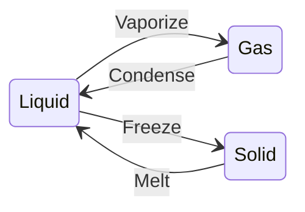

# MatterStateMachine

The simple matter state machine.  
Made with KMM and [VisualFSM](https://github.com/Kontur-Mobile/VisualFSM).

## Demo

### graph

```mermaid

stateDiagram-v2
direction LR
Liquid --> Gas : Vaporize
Gas --> Liquid : Condense
Solid --> Liquid : Melt
Liquid --> Solid : Freeze
```

## Todo

- [ ] Create Android View.
